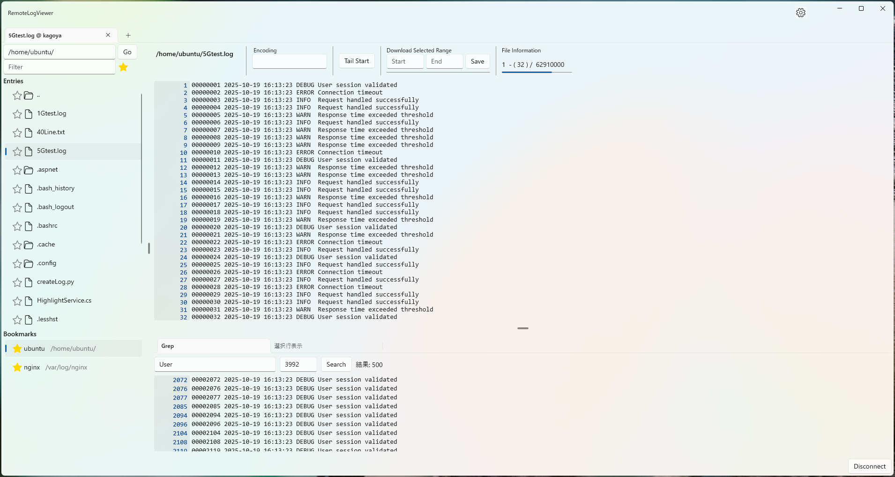

# RemoteLogViewer

巨大なログ/テキストファイルを快適に閲覧・検索できる Windows (WinUI3) アプリです。SSH 経由でサーバ上のファイルも部分的に読み込みながら扱えます。

## できること
- リモート SSH サーバーへ接続 (パスワード / 秘密鍵)
- ディレクトリを辿ってログファイルを開く
- よく使うパスをブックマーク登録・削除
- スクロールした位置だけを都度読み込み → 数百 MB～GB のファイルでも軽快表示
- 行番号でジャンプ / 検索結果から該当行へ移動
- GREP (正規表現 / 文字列) で高速検索
- 好きな語句やエラーパターンを色分けハイライト
- 気になる行だけ抜き出して別タブで確認
- 指定した行範囲を .txt 形式で保存
- 設定保存とワークスペース管理
- 複数タブでの同時閲覧

## 想定シナリオ
| シナリオ | 利用例 |
|----------|--------|
| 障害調査 | エラーメッセージを赤背景で強調、関連 ID を黄色で抽出 |
| 運用監視 | 末尾追従しつつ WARN/ERROR を色分け |
| 大規模ログ解析 | 断片的に検索し必要部分だけ保存 |
| コード生成ログ確認 | ビルド結果や警告を拾い出し絞り込み |

## インストール / 起動
1. zip を展開し `RemoteLogViewer.exe` を起動
2. 初回起動時にワークスペースの設定を行うと、以後ワークスペースフォルダに設定ファイル等が保存されます。

## 基本の使い方
### 1. ファイルを開く
- SSH 画面で接続先を選び、対象ログファイルをクリック
- 画面左に内容、下部タブに検索結果や選択行などが表示

### 2. スクロールと読み込み
- 通常のスクロール操作で未読部分が自動的に読み込まれます
- 非表示部分はメモリに保持しないため、大きいファイルでも安定します

### 3. 行ジャンプ
- 行番号入力や検索結果の行番号をクリックするとその位置へ移動

### 4. 検索 (GREP)
- 検索ボックスに語句または正規表現を入力 → Enter
- 結果一覧から行番号クリックで内容へジャンプ

### 5. ハイライト
- 設定画面で語句・色を登録 (正規表現 / 完全一致 / 大文字小文字無視など)
- 行全体を塗るか、マッチ部分だけ塗るかを選択可能
- 複数条件が重なっても最終的に重複しない色分けになるよう整理されます

### 6. 行の抜き出し
- 気になる行番号をクリック → 下部タブにその行だけ表示

### 7. 範囲保存
- 開始行・終了行を入力し保存ボタン → 指定範囲がファイルに書き出されます

### 8. 末尾追従
- tail に近い動作。新しいログが追記されると末尾へ自動スクロール (設定で停止可)

## ハイライト設定の編集
設定項目 (例):
| 項目 | 説明 |
|------|------|
| Pattern | 検索語句 / 正規表現パターン |
| PatternType | Exact (文字列) / Regex (正規表現) |
| IgnoreCase | 大文字小文字を区別しない |
| ForeColor | 文字色 (省略可) |
| BackColor | 背景色 (省略可) |
| HighlightOnlyMatch | 行全体ではなくマッチ部分だけ塗る |

ヒント:
- ノイズを抑えたい場合は背景色を淡色に設定
- エラーは赤系、警告は橙/黄、成功は緑などにすると視認性向上

## よくある質問 (FAQ)
Q. スクロールが重い 
A. 1行あたりの文字数が多いと重くなります。設定で１行あたりの表示可能文字数の制限が可能なので、制限数を減らしてください。  

Q. Grepが重い
A. Grep件数が多いと重くなります。設定でGrep最大件数の設定を見直してください。なお、再検索で続きの検索ができます。

Q. ハイライトが期待どおりにならない  
A. 同じ範囲に複数ルールが重なると後のルールが適用されません。順番を見直してください。

Q. 文字コードが違って文字化けする  
A. 画面のエンコード切替操作で再読み込みしてください。

## トラブルシューティング
| 事象 | 対策 |
|------|------|
| 接続できない | SSH 設定 / ポート / ファイアウォールを確認 |
| フリーズした | 大容量正規表現検索中の可能性。パターンを軽くする |
| 色が表示されない | 透明色設定になっていないか確認 |
| 保存失敗 | 書き込み権限とパスを確認 |

## ヒント / コツ
- 目的のログ行へ即移動したいときは検索後に行番号を直接クリック
- 細かい語句を多数ハイライトするより、状態分類 (ERROR / WARN / INFO) を優先すると見やすい
- 範囲保存は調査記録の添付資料作成に便利

## 安全 / プライバシー
- 読み込んだログはアプリ内メモリのみ保持し、外部送信しません
- 保存操作を行った範囲だけがローカルへ書き出されます

## アップデート方法
- 新しいバージョンを取得して上書き (設定は保持されます)
- 破壊的変更がある場合はリリースノートを参照してください

## 技術仕様
- **プラットフォーム**: Windows 11 (WinUI 3)
- **言語**: C# 14.0
- **フレームワーク**: .NET 9
- **UI**: WinUI 3 (XAML)
- **ログ**: Serilog (ファイル出力 + コンソール)
- **SSH**: SSH.NET
- **リアクティブ**: R3
- **DI**: Microsoft.Extensions.DependencyInjection

## ライセンス
検討中・MIT予定。

## お問い合わせ / フィードバック
不具合報告・要望は GitHub Issues へ。Pull Request も歓迎します。

---

